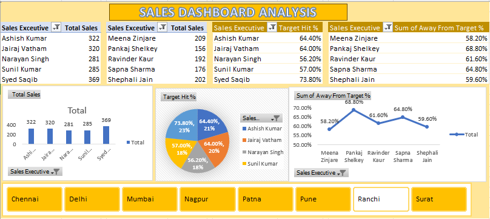
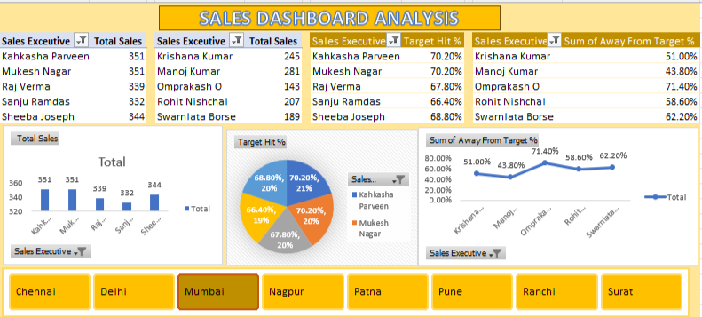

# Sales Dashboard Analysis 📊

A professional Excel-based dashboard project that provides key insights into sales performance using charts, pivot tables, and slicers.

---

## 🔍 Features

- 📅 Monthly and Category-wise Sales Breakdown
- 🌍 Region-wise Performance Overview
- 🏆 Top Selling Products
- 📈 Interactive Pivot Charts
- 🎨 Conditional Formatting for Highlights

---

## 🛠 Tools Used

- Microsoft Excel
- Pivot Tables
- Pivot Charts
- Slicers
- Data Cleaning Functions

---

## 📸 Dashboard Screenshots

### 🔹 Total Sales Chart

### 🔹 Region-wise Performance

### 🔹 Top Products Summary

---

## 📂 Folder Structure

---

## 🚀 How to Use

1. Download the Excel file
2. Open in Microsoft Excel (2016 or later)
3. Use slicers to interact with the data

---

## ⭐ Give a Star

If you found this project helpful, consider giving it a ⭐ on GitHub!

---

## 📬 Contact

📧 nickkumar366@gmail.com  
🔗 [LinkedIn](https://www.linkedin.com/in/nitesh-badwaiya/)
